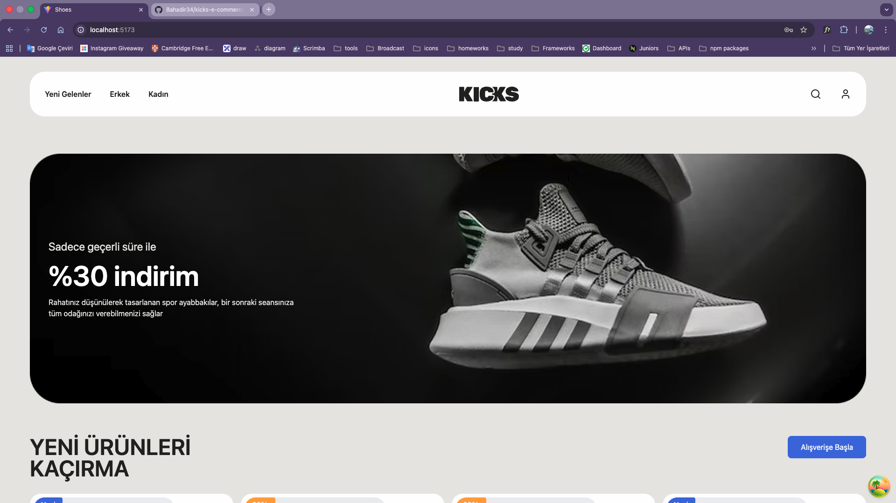
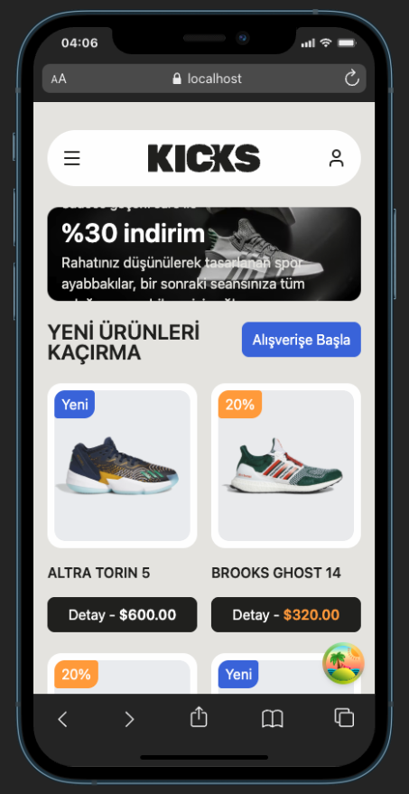
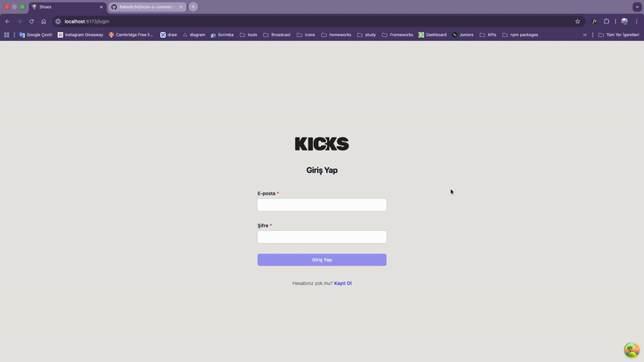

# KICKS E-Commerce Application

KICKS is an e-commerce project related with shoes.There are listing, detail and admin dashboard page on system. It was used role base authentication.

## Properties and Used Techs

- Responsive Modern UI
  - React (Component based design)
  - Tailwind
  - Formik and Yup
  - Dompurify (for security)
- Coding Tools
  - Typescript (Type safe coding)
  - axios
  - tanstack-query
  - React Router & React Router Dom (Handling page system)
  - React Paginate (Listing method of cars)

## Reach Application & Be a Contributer

Open your terminal and type below :

```bash
cd desktop
git clone https://github.com/Bahadir34/kicks-e-commerce.git
```

After clone the repo then you can run such below :

```bash
npm i
npm run dev
```

## Project Views





## Licence

This project is developed for educational purposes, so all developers who want to be a contributer for this project, they may join it.
